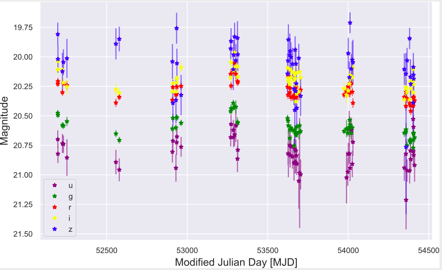

# Weighing Black Holes Using Deep Learning
_**Contributors: Joshua Yao-Yu Lin, Sneh Pandya, Devanshi Pratap, Xin Liu, Matias Carassco Kind, Volodymyr Kindratenko**_

The goal of this project is to introduce a new, interdisciplinary method in weighing supermassive black holes (SMBH).  We employ a hybrid neural convolutional neural network (CNN) and feedforward neural network (FNN) alongside robust data preprocessing.  We use light curves from the SDSS Stripe 82, virial SMBH mass estimates from SDSS DR7, DR14 datasets as ground truth, and parameters from the SDSS Damped Random Walk catalog.

# Abstract
Supermassive black holes (SMBHs) are ubiquitously found at the centers of most massive galaxies. Measuring SMBH mass is important for understanding the origin and evolution of SMBHs. However, traditional methods require spectroscopic data which is expensive to gather. We present an algorithm that weighs SMBHs using quasar light time series, circumventing the need for expensive spectra. We train, validate, and test neural networks that directly learn from the Sloan Digital Sky Survey (SDSS) Stripe 82 light curves for a sample of 38,939 spectroscopically confirmed quasars to map out the nonlinear encoding between SMBH mass and multi-color optical light curves. We find a 1&sigma; scatter of 0.37 dex between the predicted SMBH mass and the fiducial virial mass estimate based on SDSS single-epoch spectra, which is comparable to the systematic uncertainty in the virial mass estimate. Our results have direct implications for more efficient applications with future observations from the Vera C. Rubin Observatory.

This project is developed for Python3.5 interpreter on linux machine. Using Anaconda virtual environment is recommended.

To install dependencies, simply run:

`pip install -r requirement.txt`

or consult online documentation for appropriate dependencies.

# Data

1. SDSS Stripe 82 light curves: http://faculty.washington.edu/ivezic/macleod/qso_dr7/Southern.html

2. SDSS Stripe 82 light curves (expanded catalog): https://github.com/RichardsGroup/LSST_training

3. SDSS DR7 data: http://quasar.astro.illinois.edu/BH_mass/dr7.htm

4. SDSS DR14 catalog: https://sites.utu.fi/sdssdr14/

# Code
### Getting the Data

Accessing the University of Washington light curves and SDSS DR7/DR14 SMBH mass estimates are straight forward.
The process of retrieving the expanded catalog of light curves is explained in detail at the RichardsGroup Github linked above.  We thank the Drexel University group for compiling this catalog and Weixiang Yu for his guidance in retrieving the light curves.  In our implementation we utilize both the full light curves and PSF magnitudes.

### Data Preprocessing

`src/notebooks/dr7_dr14_tutorial.ipynb`
Retrieve DR7/DR14 catalog and relevant information.  Clean unphysical and high-error AGN SMBH mass estimates.  Visualize data from the catalog.

`src/notebooks/match_dr14_LC_BH.ipynb`
Match Stripe 82 light curve PSF magnitudes with DR14 catalog for FNN pipeline.  Split matched data into train and test sets.

`src/scripts/clean_stripe82.py`:
Get SDSS Stripe 82 light curves (UWashington) and clean it. Generate a .csv file of cleaned data (data in a desirable format). RA/DEC used to match light curves with DR7/DR14 catalogs.

`src/scripts/data_matching.py`:
To match the Stripe 82 (UWashington) and the DR7 catalog data to get most relevant information. Generate a .csv file of matched data.

`src/scripts/light_curve_to_image_tutorial.py`: Convert SDSS Stripe 82 light curves to images as .npy files.

### Deep learning

`src/notebooks/AGNet_mass.py`: Hybrid neural network (CNN + FNN) that takes inputs from encoded images and preprocessed features.

`src/scripts/light_curve_encoder.py` : CNN that functions as an encoder to learn information from the light curve image and outputs features.
